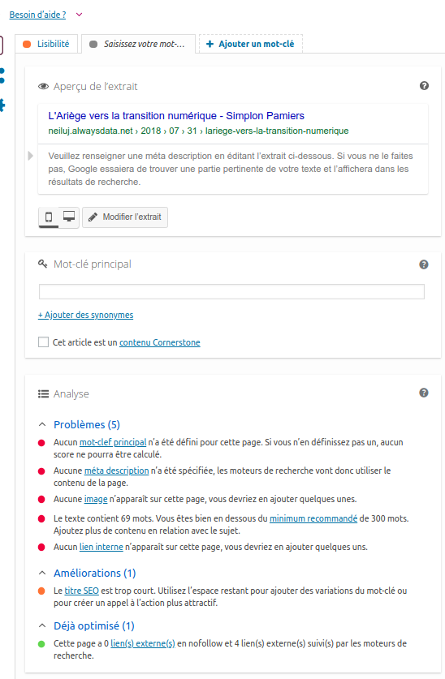

# Evaluation C7 - Wordpress
### Autheur: Julien Chénel

__Adresse du site :__ [http://neiluj.alwaysdata.net/](http://neiluj.alwaysdata.net/)

## Recommendations pour le référencement du site

* Réglages > Lecture > Décocher "Demander aux moteurs de recherche de ne pas indexer ce site"
* Optimiser les permaliens : Réglages > Permaliens > Sélectionner "Nom de l’article"
* Inscription sur des annuaires spécialisés
* Passer en connexion sécurisée HTTPS
* Ajouter des liens inter-site et vers l'extérieur du site
* Ajouter sitemap.xml et un robots.txt sur WordPress
* Supprimer le contenu dupliqué sur WordPress. Aller dans Réglages > Lecture > Pour chaque article d’un flux, fournir : l'extrait. Cette rapide optimisation va déjà éliminer une source de contenu dupliqué, passons aux autres.
* Ajouter des images, mais de poids léger. Ajouter un texte alternatif à une image.

---------------------------------------------------------------------------------

## Usage d'un plugin dédié . Exemple de Yoast SEO

* Activer une extension telle que Yoast SEO. Se rendre sur l'article ciblé. En bas de l'éditeur enrichie regarder l'analyse du plug-in concernant l'article dans la fenêtre dédiée. Dans le cas de l'article "L'Ariège vers la transition numérique", voici ce qui est ennoncé :

    * 8.3% des phrases contiennent un mot ou une phrase de transition , ce qui est inférieur au minimum recommandé de 30%.

    * Le texte a obtenu 54.1 au test du Flesch Reading Ease, ce qui est considéré comme assez difficile à lire. Essayez de faire des phrases plus courtes pour améliorer la lisibilité.

    * Aucun mot-clef principal n’a été défini pour cette page. Si vous n’en définissez pas un, aucun score ne pourra être calculé.

    * Aucune méta description n’a été spécifiée, les moteurs de recherche vont donc utiliser le contenu de la page.

    * Aucune image n’apparaît sur cette page, vous devriez en ajouter quelques unes.

    * Le texte contient 69 mots. Vous êtes bien en dessous du minimum recommandé de 300 mots. 

    * ...

|__Vue du plugin Yoast sous un article dans WordPress__|
| :------------ |
||
